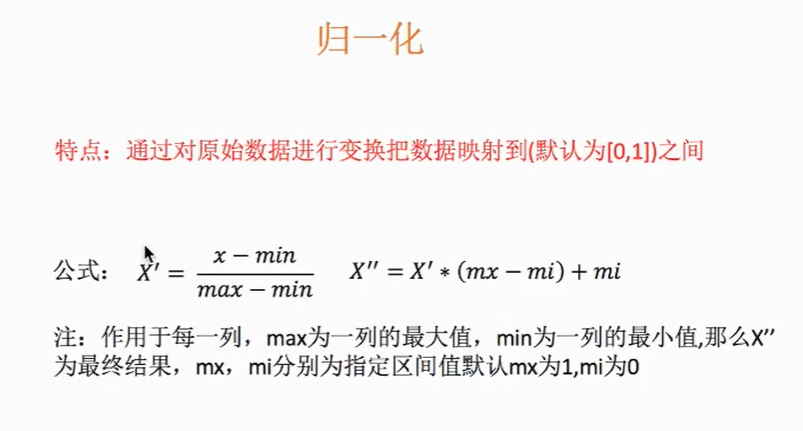
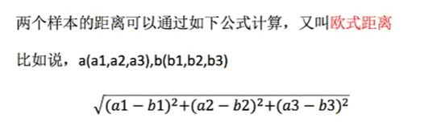

# machine-learning
机器学习

可用数据集: kaggle、scikit-learn、UCI

fit_transform(): 输入数据直接转换

fit(): 输入数据,计算平均值，方差等等

transform(): 进行数据的转换

fit_transform() = fit() + transform()
 
## 特征提取
特征抽取就是对文本等数据进行特征值化
1. 字典特征数据抽取: 把字典中一些类别的数据，分别进行转换成特征
2. 文本特征抽取：对文本数据进行特征值化
3. 中文特征抽取，
   第一种方式：先使用jieba进行分词再特征化
   第二种方式： tf: 词的频率
              idf：逆文档频率  log（总文档数量/该词出现的文档数量）
   

## 归一化
多个特征同等重要的时候，需要归一化，使得某一个特征不会对结果的影响太大。

## 标准化
如果出现异常点，由于具有一定的数据量，少量的异常点对于平均值的影响并不大，从而方差改变较小

## 特征预处理：对数据进行处理。
通过特定的统计方法，将数据转换成算法要求的数据

## 降维
1. 特征选择
     1. 主要方法
        1. Filter（过滤式）：VarianceThreshold
        2. Embedded（嵌入式）：正则化、决策树
        3. Wrapper（包裹式）  

2. 主成分分析(PAC)
    1. 本质： PAC是一种分析、简化数据集的技术
    2. 目的： 是数据维数压缩，尽可能降低源数据的维数，损失少量信息
    3. 作用： 可以削减回归分析或者聚类分析中特征的数量

## scikit-learn数据集API介绍
1. sklearn.datasets: 加载获取流行数据集
    1. datasets.load_*(): 获取小规模数据集，数据包含在datasets里
    2. datasets.fetch_*(data_home=None): 获取大规模数据集，需要从网上下载。默认目录是  ~/scikit-learn_data/

## 机器学习的开发流程
1. 数据
    1. 公司本身就有数据
    2. 合作过来的数据
    3. 购买的数据
    
2. 建立模型，根据数据类型划分应用种类
3. 数据的基本处理： pd去处理数据
4. 特征工程（ 特征进行处理 ） 重要
5. 找到合适的算法进行预测
6. 模型的评估，判定效果。模型 = 算法 + 数据
7. 上线使用。以API形式提供
8. 如果模型评估不合格
    1. 换算法\参数
    2. 特征工程

## 分类算法-k近邻算法（KNN）： 需要做标准化处理
定义： 如果一个样本在特征空间中的k个最相似（即特征空间中最邻近）的样本中的大多数属于某一个类别，则该样本也属于这个类别。

问题：
1. k值取多大？有什么影响？
    1. k值取很小： 容易受异常点影响
    2. k值取很大：容易受K值数量（类别）波动
    
2. 性能问题？
